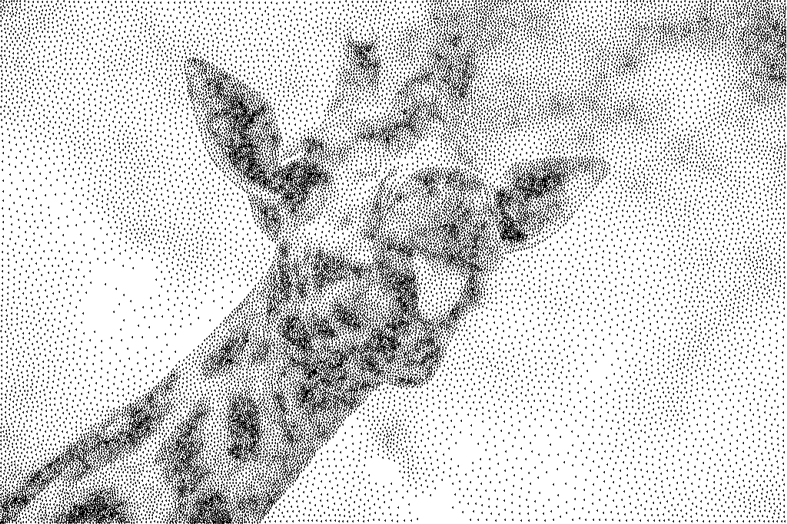
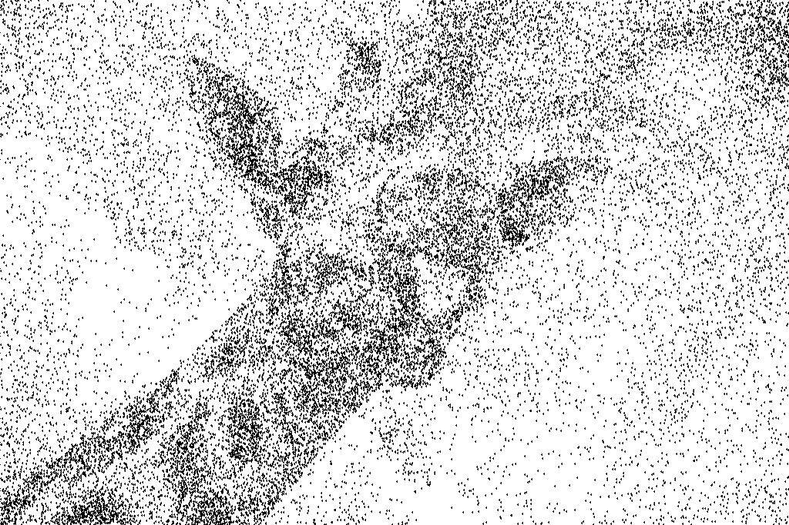
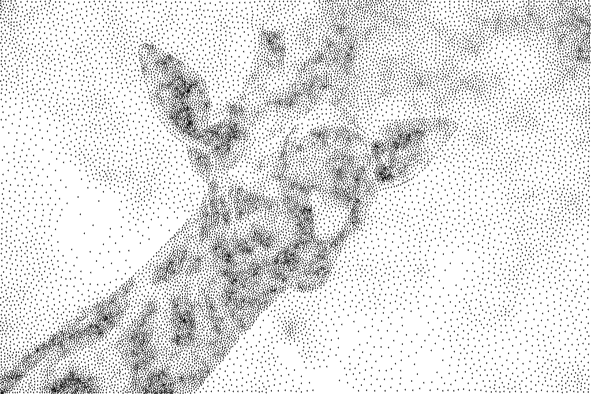
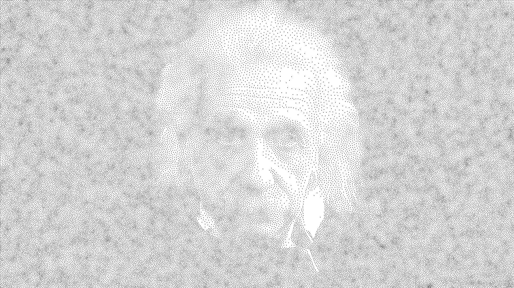
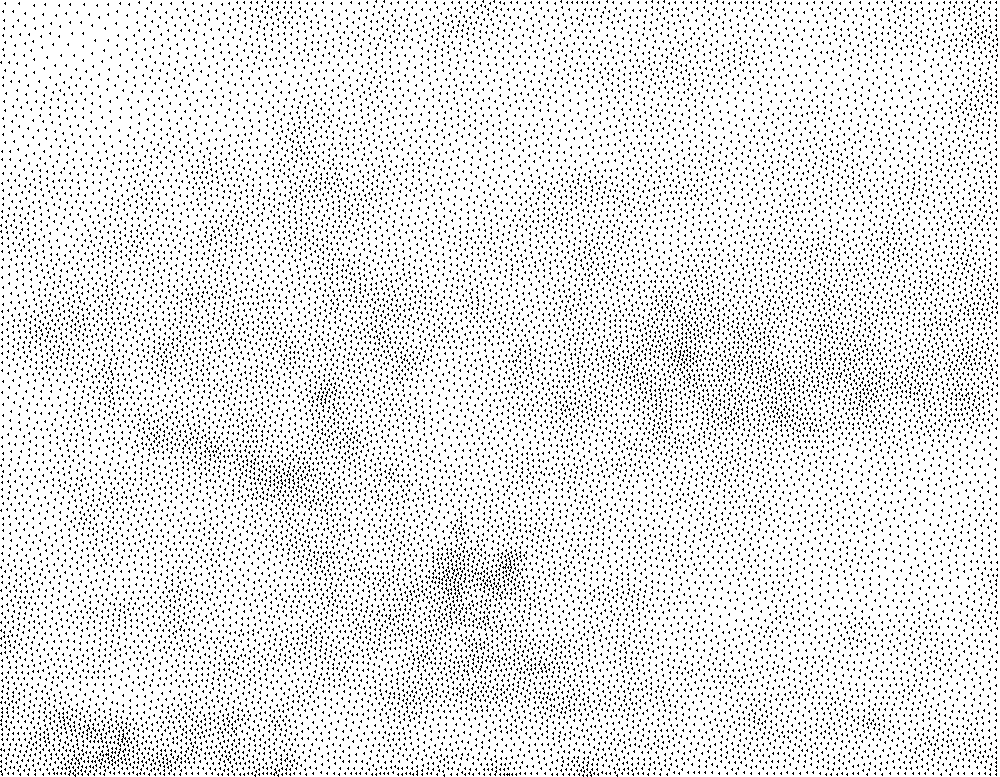
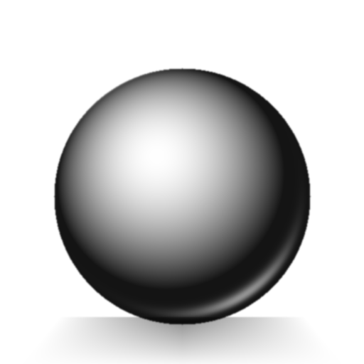
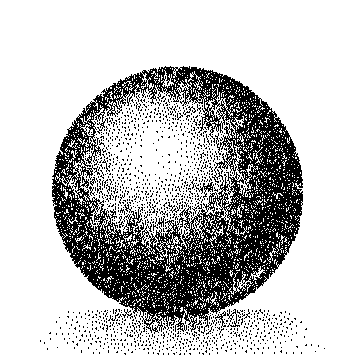
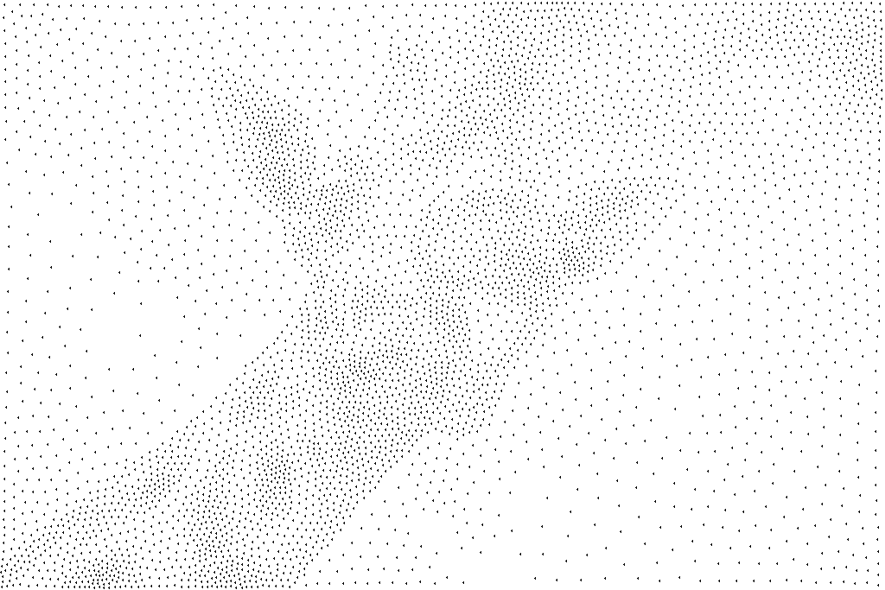
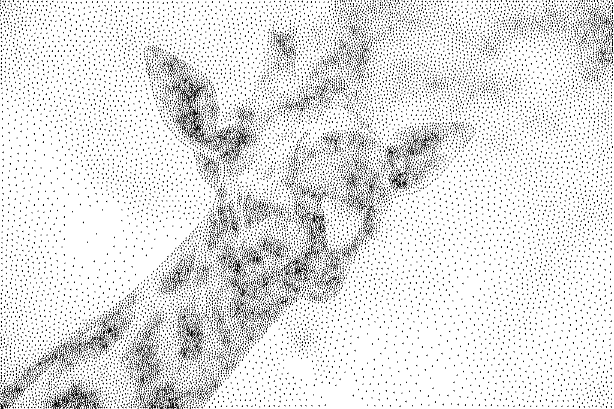
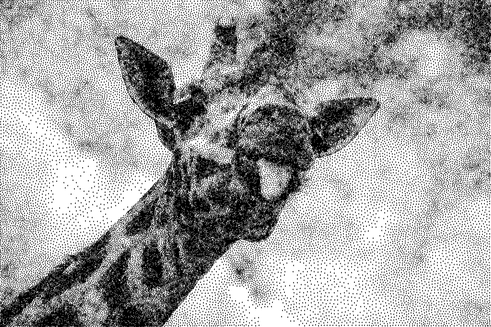

# Weighted Voronoi Stippling: From Paper to Pixels (to Performance)

While watching a video of Tsoding implementing a paper about generating nice looking leaves, it gave me the idea to look for interesting papers to implement myself. This is the first one of the series so I hope you like it! 

If you wonder why I chose a giraffe to start this article and wonder who or what a Voronoi is, then you're in the right place.

| Original | Stippled (30,000 dots) |
|:---:|:---:|
|  |  |

For the generated picture on the right, I did not use lines, shading or gradients. Only 30,000 black dots on a white background, and your brain fills in the rest. This is called **stippling** — an artistic technique [dating back to the early 16th century](https://www.archaeoink.com/blog/stippling), when Giulio Campagnola — a Venetian engraver who apparently felt that Da Vinci and Michelangelo weren't doing enough for Italian art history — invented it as a way to achieve smoother tonal transitions than what other techniques could offer at the time. It was later adopted by illustrators who could render images suitable for both print and digital media, with no colour required. Skilled stipplers might spend weeks placing tens of thousands of dots by hand, carefully varying density to create the illusion of tone. If only they knew how to write C++!

In 2002, Adrian Secord published a paper called *"Weighted Voronoi Stippling"* that automates this entire process with a rather straightforward algorithm. In this article, we're going to implement it from scratch in C++, following the paper, and then spend a bit too much time optimizing it. 

---

## The Art of Stippling

Stippling has been used for scientific illustration since at least the 18th century. Unlike hatching (parallel lines) or cross-hatching (intersecting lines), stippling only uses discrete points. This makes it a good candidate for reproduction — stippled images survive photocopying, faxing, and printing at various resolutions far better than continuous-tone artwork.

The technique is simple in principle: place dots closer together in dark areas, further apart in light areas. In practice, doing this well by hand requires a lot of patience and spatial awareness. The artist must simultaneously track local density (is this area dark enough?) and global distribution (are there visible clumps or voids?). Nothing I could do by hand for sure, but thanks to Secord, I can now make my computer do it for me.

But this is also where the naive computer approach fails. You might think: "Just randomly scatter dots, with more dots in darker regions." Let's try it.

| Random dots placed via rejection sampling | Stippled (30,000 dots) |
|:---:|:---:|
|  |  |

The random version is noisy — you can observe patches and voids here and there. The stippled approach is more structured. Each dot sits in a natural position, evenly spaced relative to its neighbors while respecting the underlying density. The difference is Lloyd relaxation, and understanding why it works requires a short detour through Voronoi diagrams.

---

## The Paper: Weighted Voronoi Stippling

### The Core Idea

A grayscale image is, from a certain perspective, similar to a density function. Dark pixels should attract more dots; light pixels should repel them. Secord formalizes it with a density function:

$$\rho(x,y) = 1 - f(x,y)$$

where $f(x,y)$ is the image intensity normalized to $[0, 1]$. A pure black pixel has $f = 0$, so $\rho = 1$ (maximum density). A pure white pixel has $f = 1$, so $\rho = 0$ (no dots wanted here).

In code, this is a one-liner during image loading:

```cpp
for (auto i = 0; i < size; ++i) {
    density[i] = 1.f - (pixels[i] / 255.f);
}
```

Looking at the rejection sampling image above, the question becomes: given this density function, how do we place $N$ dots such that they're well-distributed while still respecting the density?

### Voronoi Diagrams

Lets say you sow $N$ seeds onto a field. Each seed claims all the ground closer to it than to any other seed. The boundaries between these territories form a Voronoi diagram — a partition of space into convex cells, one per seed.

Each of these Voronoi cell has a **weighted centroid** — the center of mass computed using our density function as a weight. If a cell covers a dark region, the centroid gets pulled toward the dark pixels. If it sits between light and dark areas, the centroid pulls toward the dark side.

If we could arrange our dots so that each one sits exactly at the weighted centroid of its own Voronoi cell, we'd have a **centroidal Voronoi tessellation** (CVT). In a CVT, points are naturally well-spaced: if a point drifts too close to a neighbor, its Voronoi cell shrinks, its centroid shifts away, and the point would want to move back. It's a self-correcting equilibrium.

### Lloyd's Algorithm — The Iterative Loop

We can't compute a CVT directly, but we can iterate toward one. This is Lloyd's algorithm, which is described in the paper in the following way:

1. **Assign**: Compute the Voronoi diagram (assign each pixel to its nearest generator)
2. **Accumulate**: Compute the weighted centroid of each cell
3. **Move**: Relocate each generator to its cell's centroid
4. **Repeat** until generators barely move

Here's the main loop from the brute-force implementation:

```cpp
for (auto iter = 0; iter < max_iterations; ++iter) {
    assign_voronoi(generators, voronoi, height);
    compute_centroids(voronoi, density, accum, width, height);

    auto move = move_generators(generators, accum, width, height);
    if (move.average_displacement < convergence) {
        break;
    }
}
```

This is the main loop that will be reused for all the iterative techniques. `assign_voronoi` labels every pixel with the index of its nearest generator. `compute_centroids` then sweeps the image once, accumulating the density-weighted sum of pixel coordinates for each cell (its mass and moment). Finally, `move_generators` divides moment by mass to get the weighted centroid of each cell and moves the generator there, returning the average displacement so the loop knows when to stop.

1. `assign_voronoi`

The brute-force Voronoi assignment iterates over every pixel and every generator, keeping the closest one:

```cpp
void assign_voronoi_brute_force(std::span<vec2> generators,
                                std::span<uint32_t> voronoi,
                                size_t width,
                                size_t height) 
{
    for (auto y = 0; y < height; ++y) {
        for (auto x = 0; x < width; ++x) {
            float    best_dist = std::numeric_limits<float>::max();
            uint32_t best_idx  = 0;

            for (auto i = 0; i < generators.size; ++i) {
                float dx = generators[i].x - x;
                float dy = generators[i].y - y;
                if (auto dist = dx*dx + dy*dy; dist < best_dist) {
                    best_dist = dist;
                    best_idx  = i;
                }
            }
            voronoi[y * width + x] = best_idx;
        }
    }
}
```

2. `compute_centroids` 

The weighted centroid formula from the paper is:

$$C_i = \frac{\int_{V_i} x \cdot \rho(x) \, dA}{\int_{V_i} \rho(x) \, dA}$$

Since we're working with a discrete pixel grid, the integral becomes a sum. For each pixel belonging to generator $i$, we accumulate mass (density) and moment (position times density), then divide:

```cpp
void compute_centroids(std::span<uint32_t> voronoi,
                       std::span<float> density,
                       std::span<accumulator> accum,
                       size_t width,
                       size_t height)
{
    std::ranges::fill(accum, accumulator{});

    for (auto y = 0; y < height; ++y) {
        for (auto x = 0; x < width; ++x) {
            auto idx = (y * width) + x;
            auto gen = voronoi[idx];
            double d = density[idx];
            accum[gen].mass += d;
            accum[gen].moment_x += x * d;
            accum[gen].moment_y += y * d;
        }
    }
}
```

Each `accumulator` stores `mass`, `moment_x`, and `moment_y`. The centroid is then simply `moment / mass`.

3. `move_generators` 

The movement step does not follow exactly what is done in the paper — instead of computing $N$ individual square roots for displacement, it accumulates squared displacements and takes a single `sqrt` at the end to get the RMS:

```cpp
double move_generators(std::span<vec2>              generators,
                       std::span<const accumulator> accum,
                       const std::size_t            width,
                       const std::size_t            height)
{
    double sum_sq_displacement = 0.0;

    for (auto i = 0; i < generators.size(); ++i) {
        if (accum[i].mass > 0.0) {
            const auto new_x = std::clamp(accum[i].moment_x / accum[i].mass, 0.f, fw);
            const auto new_y = std::clamp(accum[i].moment_y / accum[i].mass, 0.f, fh);

            const auto dx = new_x - generators[i].x;
            const auto dy = new_y - generators[i].y;
            sum_sq_displacement += dx * dx + dy * dy;

            generators[i] = {new_x, new_y};
        }
}

return std::sqrt(sum_sq_displacement / generators.size());
```

When the average displacement drops below a threshold, the algorithm has converged — points have settled into their natural positions.

--

However, these methods/steps are far from taking the same time to execute. Timing each phase on the giraffe image (1024x683, 5,000 generators, 10 iterations) reveals where the time actually goes, and thus where our optimization efforts should be focused:

**Brute force (Level 1):**

| Phase | Time | % of total |
|-------|-----:|----------:|
| `assign_voronoi` | 21,160 ms | **100.0%** |
| `compute_centroids` | 6.7 ms | 0.0% |
| `move_generators` | 0.1 ms | 0.0% |

That's not a rounding error. The Voronoi assignment is literally the entire cost — centroid computation and generator movement together are less than a fraction of a percent. Even after switching to a spatial grid (which we will look into later), the distribution barely changes:

**Spatial grid (Level 2):**

| Phase | Time | % of total |
|-------|-----:|----------:|
| `populate_grid` | 0.4 ms | 0.3% |
| `assign_voronoi` | 161.0 ms | **95.9%** |
| `compute_centroids` | 6.4 ms | 3.8% |
| `move_generators` | 0.1 ms | 0.0% |

The assignment step is still 96% of the total time. This is where every optimization in the next section focuses — it's the only thing worth speeding up, at least to get a working real-time algorithm.

### Initial Point Placement — Rejection Sampling

Starting from uniformly random points would work, but convergence would be painfully slow. Secord suggests starting from a density-weighted distribution, so the initial layout already roughly matches the image.

The implementation uses rejection sampling (`src/common.hpp:233-266`): pick a random pixel, accept it with probability proportional to its density. If a million consecutive rejections occur (the image is mostly white), fall back to `std::discrete_distribution` which handles sparse densities gracefully:

```cpp
while (points.size() < count) {
    const auto x = dist_x(rng);
    const auto y = dist_y(rng);
    if (density[(y * width) + x] > dist_p(rng)) {
        points.emplace_back(static_cast<float>(x), static_cast<float>(y));
        attempts_since_hit = 0;
    } else if (++attempts_since_hit >= max_misses) {
        while (points.size() < count) {
            points.push_back(fallback_sampler.sample_point(rng));
        }
    }
}
```

### Seeing It Come Together

Watch the algorithm converge. From chaotic rejection-sampled points to structured stipple art:

| Iteration 1 | Iteration 5 | Iteration 10 | Iteration 25 |
|:---:|:---:|:---:|:---:|
|  |  |  |  |

By iteration 5, the structure is already emerging. By 25, it's nearly converged. The first few iterations do the heavy lifting — each subsequent iteration makes smaller, more precise adjustments.

Different subjects produce different effects:

| | Original | Stippled |
|---|:---:|:---:|
| **Einstein** (75k, portrait) |  |  |
| **Monet** (20k, painting) | |  |
| **Sphere** (20k, gradient) |  |  |

High-contrast portraits work well — the algorithm captures facial features with surprising clarity at high generator counts. Paintings produce an interesting effect where brushstroke patterns emerge through dot density. And the sphere is a stress test for uniformity: you want smooth gradients without visible artifacts.

Generator count matters too:

| 5,000 dots | 20,000 dots | 75,000 dots |
|:---:|:---:|:---:|
|  |  |  |

More generators means more detail, but with diminishing returns — and exponentially more computation.

---

## Making It Fast / Actually runnable

The brute force / naive algorithm is incredibly slow. For the simple giraffe image (1024x683), it takes 40s to go through 5 iterations with only 20k generators. This becomes much worse for bigger pictures and with more generators, which are needed to get a better result. We already what part of the algorithm takes the longest. Let's find out why and look at optimizations that will make the algorithm much faster. We will first look at their implementation and then compare their performance.

### The Bottleneck

The brute-force Voronoi assignment checks every pixel against every generator. For each pixel, we compute the distance to all $G$ generators and keep the closest. That's $O(W \times H \times G)$ per iteration.

For a 1920x1080 image with 20,000 generators: $1920 \times 1080 \times 20000 = 41.4$ billion distance calculations per iteration. At 50 iterations, that's over 2 trillion floating-point comparisons. 

```cpp
for (int y = 0; y < height; ++y) {
    for (int x = 0; x < width; ++x) {
        float    best_dist = std::numeric_limits<float>::max();
        uint32_t best_idx  = 0u;

        for (int i = 0; i < generator_count; ++i) {
            const float dx = generators[i].x - static_cast<float>(x);
            const float dy = generators[i].y - static_cast<float>(y);
            const float dist = dx * dx + dy * dy;
            if (dist < best_dist) {
                best_dist = dist;
                best_idx = i;
            }
        }
        voronoi[(y * width) + x] = best_idx;
    }
}
```

Three nested loops, the innermost one running billions of times. This is what we will try to optimize first.

### Level 2: Spatial Grid

Since we're trying to find the minimal distance between generators and pixels, a pixel at position $(x, y)$ doesn't care about generators on the other side of the image. It only needs to check *nearby* generators.

A spatial grid divides the image into cells. Each generator is placed into the cell covering its position. To find the nearest generator for a pixel, we only check generators in the surrounding cells — a 5x5 neighborhood in our implementation.

The cell size is tuned to balance between too many cells (overhead) and too few (too many generators per cell):

```cpp
spatial_grid make_spatial_grid(size_t width, std::size_t height,
                               size_t num_generators)
{
    const float cell_size =
        static_cast<float>(std::max(width, height))
        / (2.f * std::sqrt(static_cast<float>(num_generators)));
    // ...
}
```

The denominator $2*\sqrt{G}$ ensures each cell contains roughly a handful of generators. The nearest-neighbor query then sweeps a 5x5 block:

```cpp
uint32_t nearest_in_grid(spatial_grid& grid, std::span<vec2> generators,
                         float qx, float qy)
{
    int min_y = std::max(0, cell_row - 2);
    int max_y = std::min(grid.rows - 1, cell_row + 2);
    int min_x = std::max(0, cell_col - 2);
    int max_x = std::min(grid.cols - 1, cell_col + 2);

    for (auto [ny, nx] : std::views::cartesian_product(y_range, x_range)) {
        for (auto gen_idx : grid.cells[cell_idx]) {
            auto dist = gx * gx + gy * gy;
            if (dist < best_dist) { 
                best_dist = dist; 
                best_idx = gen_idx; 
            }
        }
    }
    return best_idx;
}
```

Complexity drops from $O(W \times H \times G)$ to $O(W \times H \times K)$ where $K$ is the average number of generators in a 5x5 neighborhood — typically 25-50, regardless of total generator count. I tried to balance the value of `cell_size` to find the best performance to picture quality ratio. Bigger cells mean lower performance but slightly higher quality results. 

### Level 3: Prefix-Sum Centroids

The Voronoi assignment is the bottleneck, but can we also speed up centroid computation? The standard approach iterates over every pixel — $O(W \times H)$ per iteration.

Secord's paper itself suggests an optimization (Section 2.2.1): during the Voronoi assignment pass, record horizontal *spans* of consecutive pixels belonging to the same generator. Then, using prefix sums over the density and position-weighted density, each span's contribution to its generator's centroid can be computed in $O(1)$.

The prefix tables are built once:

```cpp
for (int y = 0; y < height; ++y) {
    double sum_density = 0.;
    double sum_x_density = 0.;
    for (int x = 0; x < width; ++x) {
        double d = density[row + x];
        sum_density += d;
        sum_x_density += (x * d);
        prefix_density[row + x] = sum_density;
        prefix_x_density[row + x] = sum_x_density;
    }
}
```

Then centroid accumulation becomes a simple range query per span:

```cpp
for (auto& span : spans) {
    auto span_mass = p_right - p_left;
    accum[span.generator].mass += span_mass;
    accum[span.generator].moment_y += fy * span_mass;
    accum[span.generator].moment_x += rx_right - rx_left;
}
```

Depending on the image size, this actually doesn't even improve the performance over the previous level — the centroid computation was never the real bottleneck. The resulting code is slower on smaller images, and gains are low even for larger ones.

### Level 4: Quadtree Nearest-Neighbor

For very large generator counts, even the spatial grid struggles — the constant factor in $O(K)$ grows. A quadtree offers $O(\log G)$ per-pixel nearest-neighbor queries with aggressive pruning.

The implementation in this example uses a bucket size of 16 (leaf nodes hold up to 16 points). The nearest-neighbor search prunes entire subtrees when the bounding box distance exceeds the current best:

```cpp
void nearest_impl(std::size_t node_index,
                float qx, float qy,
                float& best_dist, uint32_t& best_idx)
{
    auto& current_node = nodes[node_index];
    float dx = std::max(0.f, std::max(current_node.x0 - qx, qx - current_node.x1));
    float dy = std::max(0.f, std::max(current_node.y0 - qy, qy - current_node.y1));
    if (dx * dx + dy * dy >= best_dist) {
        return;  // Prune: this subtree can't contain a closer point
    }

    if (current_node.is_leaf) {
        // Check all points in this leaf
        for (auto i = current_node.point_start;
             i < current_node.point_start + current_node.point_count; ++i) {
            // ... standard distance check ...
        }
        return;
    }

    // Visit quadrant containing query point first (most likely to tighten best_dist)
    auto primary = quad_of(mx, my, {qx, qy});
    for (auto quadrant : visit_order[primary]) {
        nearest_impl(first_child + quadrant, qx, qy, best_dist, best_idx);
    }
}
```

Two optimizations work together here:
1. **AABB pruning**: if the squared distance from the query point to the node's bounding box already exceeds our best distance, skip the entire subtree
2. **Visit order**: check the quadrant containing the query point first — this tightens `best_dist` early, causing more aggressive pruning of the other three quadrants

### Parallelization

The Voronoi assignment parallelizes naturally — each pixel's nearest-neighbor query is independent of every other pixel. We have two approaches:

**Manual threading** with `std::jthread`: divide rows among workers, each thread writes to its own range of the voronoi buffer. For centroids, we use thread-local accumulators to avoid false sharing, then reduce:

```cpp
// Each thread writes to disjoint row ranges -- no synchronization needed
for (int t = 0; t < num_workers; ++t) {
    workers.emplace_back([&tree, voronoi, width, y_begin, y_end] {
        for (auto y = y_begin; y < y_end; ++y) {
            for (auto x = 0; x < width; ++x) {
                voronoi[(y * width) + x] = tree.nearest(x, fy);
            }
        }
    });
}
```

**Parallel STL** with `std::execution::par_unseq` — the same thing in three lines:

```cpp
std::for_each(std::execution::par_unseq, rows.begin(), rows.end(),
    [&tree, &voronoi, w](std::size_t y) {
        for (auto x = 0uz; x < w; ++x) {
            voronoi[(y * w) + x] = tree.nearest(x, fy);
        }
    });
```

TBB handles the scheduling in the background. Both approaches achieve near-linear scaling, but the manual version also parallelizes the centroid computation with thread-local accumulators — avoiding the cache-thrashing you'd get from multiple threads updating the same accumulator array.

### Level 5: Tiled Supersampling

This is the quality play. Instead of evaluating the nearest generator once per pixel, we supersample — evaluating at $S \times S$ sub-pixel positions within each pixel. This produces more precise centroids, meaning fewer iterations to converge.

The catch: naively supersampling the entire image is expensive. So we tile the image, and for each tile, we collect only the generators that *could* be nearest to any pixel in that tile (using the global spatial grid). Then we build a tiny local spatial grid for just those candidates:

```cpp
for (auto tile_y0 = 0uz; tile_y0 < image.height; tile_y0 += tile_step) {
    for (auto tile_x0 = 0uz; tile_x0 < image.width; tile_x0 += tile_step) {
        const auto window = collect_tile_candidates(
            state, *generators, image.width, image.height,
            tile_x0, tile_y0, tile_x1, tile_y1, overlap);
        // Build local grid, supersample within tile...
    }
}
```

An overlap region around each tile ensures correctness at boundaries — a pixel near the tile edge needs to consider generators slightly outside the tile. The candidate collection uses a mark-based deduplication system for $O(1)$ duplicate detection (`src/level5_tiled.cpp:29-36`).

### Benchmark Results

All benchmarks run 50 iterations of Lloyd relaxation (unless noted). Times are total wall-clock for the full run. Machine: AMD Ryzen 9 7950X (32 threads), 64 GB DDR5, compiled with GCC 15.2 and `-O3 -march=native`.

#### Giraffe (1024x683) — 699,392 pixels

| Level | Variant | Generators | Total Time | ms/iter |
|-------|---------|------------|------------|---------|
| 1 | Brute Force | 1,000 | 8,311 ms | 415.6 |
| 2 | Spatial Grid | 5,000 | 742 ms | 14.8 |
| 2 | Spatial Grid | 10,000 | 863 ms | 17.3 |
| 2 | Spatial Grid | 20,000 | 1,105 ms | 22.1 |
| 2 | + par_unseq | 5,000 | 106 ms | 2.1 |
| 2 | + par_unseq | 10,000 | 110 ms | 2.2 |
| 2 | + par_unseq | 20,000 | 129 ms | 2.6 |
| 3 | Prefix Sum | 5,000 | 851 ms | 17.0 |
| 3 | Prefix Sum | 10,000 | 1,061 ms | 21.2 |
| 3 | Prefix Sum | 20,000 | 1,414 ms | 28.3 |
| 4 | Quadtree | 5,000 | 2,435 ms | 48.7 |
| 4 | Quadtree | 10,000 | 2,787 ms | 55.7 |
| 4 | Quadtree | 20,000 | 3,189 ms | 63.8 |
| 4 | + parallel | 5,000 | 192 ms | 3.8 |
| 4 | + parallel | 10,000 | 227 ms | 4.5 |
| 4 | + parallel | 20,000 | 269 ms | 5.4 |
| 4 | + par_unseq | 5,000 | 200 ms | 4.0 |
| 4 | + par_unseq | 10,000 | 222 ms | 4.4 |
| 4 | + par_unseq | 20,000 | 247 ms | 4.9 |

#### Einstein (1920x1080) — 2,073,600 pixels

| Level | Variant | Generators | Total Time | ms/iter |
|-------|---------|------------|------------|---------|
| 2 | Spatial Grid | 5,000 | 2,157 ms | 43.1 |
| 2 | Spatial Grid | 10,000 | 2,265 ms | 45.3 |
| 2 | Spatial Grid | 20,000 | 2,643 ms | 52.9 |
| 2 | + par_unseq | 5,000 | 287 ms | 5.7 |
| 2 | + par_unseq | 10,000 | 285 ms | 5.7 |
| 2 | + par_unseq | 20,000 | 317 ms | 6.3 |
| 3 | Prefix Sum | 5,000 | 2,417 ms | 48.3 |
| 3 | Prefix Sum | 10,000 | 2,710 ms | 54.2 |
| 3 | Prefix Sum | 20,000 | 3,463 ms | 69.3 |
| 4 | Quadtree | 5,000 | 7,358 ms | 147.2 |
| 4 | Quadtree | 10,000 | 8,093 ms | 161.9 |
| 4 | Quadtree | 20,000 | 9,791 ms | 195.8 |
| 4 | + parallel | 5,000 | 483 ms | 9.7 |
| 4 | + parallel | 10,000 | 530 ms | 10.6 |
| 4 | + parallel | 20,000 | 648 ms | 13.0 |
| 4 | + par_unseq | 5,000 | 562 ms | 11.2 |
| 4 | + par_unseq | 10,000 | 587 ms | 11.7 |
| 4 | + par_unseq | 20,000 | 664 ms | 13.3 |

#### David (2752x1536) — 4,227,072 pixels

| Level | Variant | Generators | Total Time | ms/iter |
|-------|---------|------------|------------|---------|
| 2 | Spatial Grid | 5,000 | 4,335 ms | 86.7 |
| 2 | Spatial Grid | 10,000 | 4,448 ms | 89.0 |
| 2 | Spatial Grid | 20,000 | 4,584 ms | 91.7 |
| 2 | + par_unseq | 5,000 | 663 ms | 13.3 |
| 2 | + par_unseq | 10,000 | 668 ms | 13.4 |
| 2 | + par_unseq | 20,000 | 667 ms | 13.3 |
| 3 | Prefix Sum | 5,000 | 4,290 ms | 85.8 |
| 3 | Prefix Sum | 10,000 | 4,378 ms | 87.6 |
| 3 | Prefix Sum | 20,000 | 4,639 ms | 92.8 |
| 4 | Quadtree | 5,000 | 11,640 ms | 232.8 |
| 4 | Quadtree | 10,000 | 13,149 ms | 263.0 |
| 4 | Quadtree | 20,000 | 14,493 ms | 289.9 |
| 4 | + parallel | 5,000 | 816 ms | 16.3 |
| 4 | + parallel | 10,000 | 888 ms | 17.8 |
| 4 | + parallel | 20,000 | 1,034 ms | 20.7 |
| 4 | + par_unseq | 5,000 | 1,064 ms | 21.3 |
| 4 | + par_unseq | 10,000 | 1,096 ms | 21.9 |
| 4 | + par_unseq | 20,000 | 1,146 ms | 22.9 |

#### What the numbers tell us

The spatial grid is the single biggest win. On giraffe with 1,000 generators, brute force takes 416 ms/iter. The spatial grid with *five times* more generators (5,000) takes just 14.8 ms/iter — a 28x speedup despite doing 5x more work. The grid makes the cost nearly independent of generator count because the 5x5 neighborhood contains a roughly constant number of candidates.

The prefix-sum centroid optimization (Level 3) is *slower* than Level 2 at for the first two images. The overhead of building spans and prefix tables exceeds the savings from faster centroid computation. The centroid pass was never the bottleneck — it's $O(W \times H)$ regardless, just iterating pixels linearly.

The quadtree (Level 4, sequential) is rather disappointing — 3-4x slower than the spatial grid across the board. Maybe my implementation is just bad! Or maybe we have more playing room with the cell size for the spatial grid (while achieving almost identical quality results). The $O(\log G)$ per-pixel theoretical advantage doesn't materialize because the constant factor is high: recursive traversal, pointer chasing through tree nodes, branch mispredictions at each level. The spatial grid's flat array lookups and tight inner loop simply win at these generator counts.

Parallelism brings even bigger gains. The `par_unseq` spatial grid (Level 2) achieves 6-7x speedup on 16 cores — not perfect linear scaling, but the sequential centroid computation and grid population create a serial bottleneck. The manual `std::jthread` implementation (Level 4 parallel) slightly outperforms `par_unseq` for the quadtree case because it also parallelizes centroid computation with thread-local accumulators.

An interesting pattern: on the David image (4.2M pixels), the par_unseq spatial grid at 20k generators (667 ms) beats the parallel quadtree at 20k generators (1,034 ms) by 35%. The spatial grid's cache-friendly access pattern scales better with image size than the quadtree's recursive pointer chasing.

### Auto-Vectorization Investigation

Compiling with `-O3 -march=native`, what does the compiler actually vectorize? Let's examine the disassembly of key hot loops.

#### `quadtree::nearest_impl` — the recursive NN search

The compiler emits scalar SSE/AVX instructions (`vmovss`, `vsubss`, `vmaxss`, `vcomiss`) for the AABB pruning test. No SIMD *widening* happens here — and it can't, because the pruning logic is serial: each comparison depends on the previous result, and the recursive structure prevents batch processing.

> AABB distance check: dx = max(0, max(x0 - qx, qx - x1))
```asm
vsubss %xmm5,%xmm0,%xmm0     ; qx - x0
vsubss %xmm3,%xmm7,%xmm2     ; x1 - qx (negated)
vmaxss %xmm2,%xmm0,%xmm0     ; max of both
vxorps %xmm2,%xmm2,%xmm2     ; zero
vcomiss %xmm2,%xmm0          ; compare with 0
ja     early_exit            ; prune if > 0 contribution from x alone
```

The `v` prefix is AVX encoding (using VEX), but the `ss` suffix means "scalar single" — operating on one float at a time. The compiler uses AVX register naming but processes scalars.

#### `compute_centroids_parallel` — the accumulation inner loop

This is the most interesting case. The compiler uses a clever mix of scalar and 128-bit packed operations:

> Inner loop: for each pixel, accumulate into thread-local accumulators
```asm
vcvtss2sd (%rsi,%rax,4),%xmm2,%xmm1   ; load density[idx], convert float->double
mov       (%rcx,%rax,4),%edx          ; load voronoi[idx] (generator ID)
vcvtsi2sd %rax,%xmm2,%xmm0            ; convert x coordinate to double
vmulsd    %xmm1,%xmm0,%xmm0           ; x * density
lea       (%rdx,%rdx,2),%rdx          ; gen_id * 3 (accumulator stride)
vunpcklpd %xmm0,%xmm1,%xmm0           ; pack {density, x*density} into xmm0
vfmadd213sd 0x10(%r8,%rdx,8),%xmm3,%xmm1  ; moment_y += y * density (FMA!)
vaddpd    (%r8,%rdx,8),%xmm0,%xmm0    ; {mass, moment_x} += {density, x*density}
vmovupd   %xmm0,(%r8,%rdx,8)          ; store mass and moment_x together
vmovsd    %xmm1,0x10(%r8,%rdx,8)      ; store moment_y
```

The compiler packs `mass` and `moment_x` updates into a single 128-bit `vaddpd` — processing two doubles simultaneously. It also uses `vfmadd213sd` (fused multiply-add) for the `y * density` accumulation, saving a separate multiply. This is genuinely clever codegen: the compiler recognized that two of the three accumulator fields can be updated in one vector operation.

However, there's no *wider* vectorization (256-bit or 512-bit AVX). The bottleneck is the indirect store — `accum[voronoi[idx]]` is a scatter pattern. Consecutive pixels may belong to different generators, so the accumulator writes go to unpredictable addresses. The compiler can't prove that consecutive iterations access the same accumulator, so it can't batch the stores.

In total, `libstippling_core.a` contains **6,474 vector instructions**. Most are scalar-width operations using AVX encoding — the compiler uses AVX registers throughout but rarely operates on multiple data elements simultaneously. The exceptions are the centroid accumulation (128-bit packed doubles) and the zeroing of accumulator arrays (512-bit `vmovupd %zmm0` for bulk memset).

### Cache Considerations

The memory access patterns in this algorithm are worth examining:

- **Voronoi buffer**: accessed linearly in row-major order during both assignment and centroid computation. This is prefetcher-friendly and about as good as it gets.
- **Spatial grid cells**: accessing generators through the grid introduces a level of indirection — we index into the cell's vector, then use that index to access the generator array. But because the grid's cell size is tuned to the generator distribution, generators in nearby cells tend to be nearby in the original array too.
- **Accumulator array**: the centroid computation scatters updates to accumulators indexed by generator ID. This is essentially a random-access pattern — a pixel at position $(10, 10)$ and a pixel at $(10, 11)$ might belong to different generators, causing the accumulator access to jump around. For large generator counts, this can cause cache misses.
- **Thread-local accumulators**: the parallel implementation (`level4_parallel`) gives each thread its own accumulator array. This both eliminates false sharing *and* reduces the working set per thread — each thread's accumulator array fits in a smaller cache footprint.

---

## Conclusion

We started with a 20-year-old paper and a simple idea: iterate between Voronoi assignment and centroid computation until dots settle into equilibrium. The math is a weighted center-of-mass calculation. The loop is four lines of code.

The results are genuinely beautiful — there's something satisfying about an algorithm that produces art. And the performance investigation reveals the usual truth of computational geometry: the right data structure changes everything. A spatial grid turns an $O(N \cdot G)$ problem into $O(N \cdot K)$. A quadtree makes it $O(N \cdot \log G)$. Parallelism gives you another order of magnitude. Each optimization is clean and composable.

You can find the source code [on GitHub](https://github.com/pmusic/weighted-voronoi-stippling-cpp). The original paper is: Adrian Secord, *"Weighted Voronoi Stippling"*, Proceedings of the 2nd International Symposium on Non-Photorealistic Animation and Rendering (NPAR), 2002.

---

*This is the first article on cppapers — a site about implementing academic papers in C++ and exploring what happens when theory meets practice. Next time, we'll pick another paper.*
